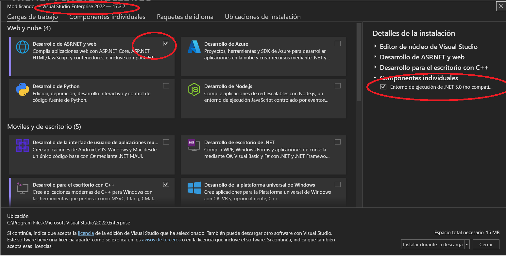
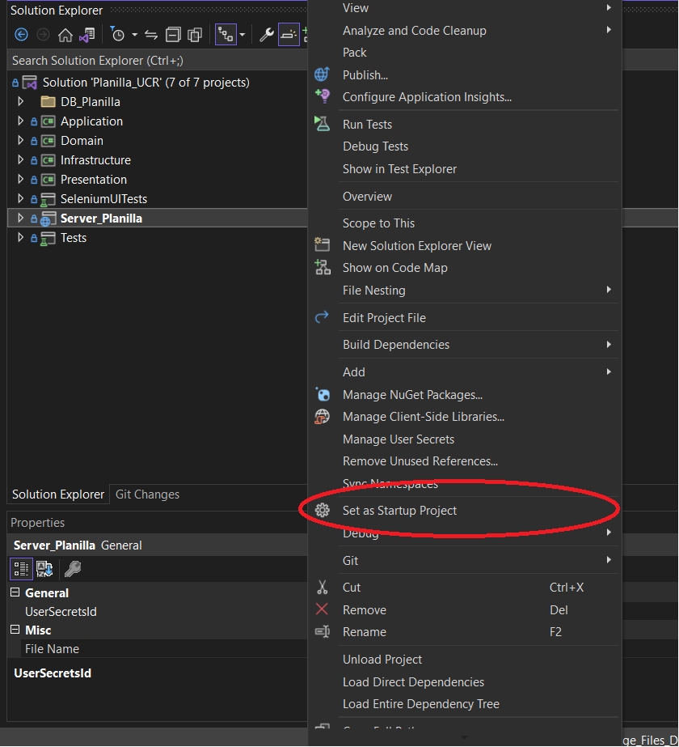
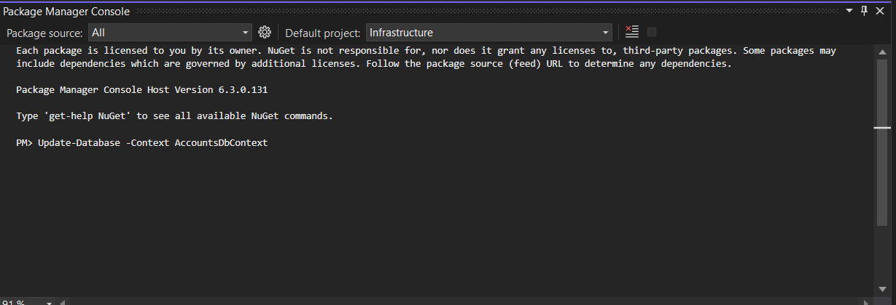
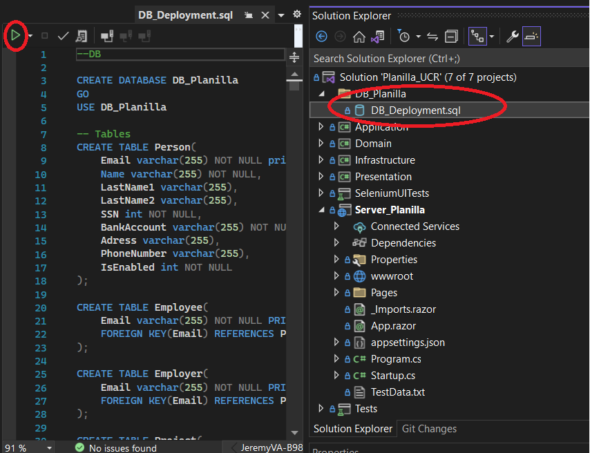
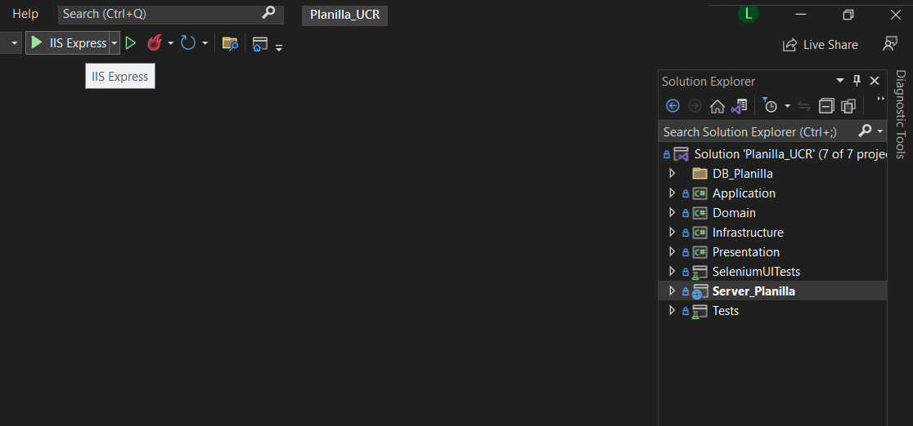

# Planilla_UCR
The goal of this application is allow you to pay bills easily, efficiently and safely. 
Transversely,we show practical use of clean code design rules, the use of a clean architecture based on DomainDrivenDesign, to generate maintainable code, unit tests and UI tests.

## Execution instructions
1) Clone the repository locally, using Visual Studio

2) Make sure you have .net 5.0 installed and ASP.net web development

3) Right click on the Server_Planilla project and select it as the start project

4) With the web server as the default project. and the selected infrastructure layer.
From the Package manager console run:
Update-Database -Context AccountsDbContext

5) Run Planilla data base using vs options

6) Click on the button to run using ISSExpress

# Colaborators
● Leonel Campos Murillo. B91545.  
● Nayeri Azofeifa Porras. B90841.  
● Wendy Ortiz Alfaro. B75584.  
● Ronald Mauricio Palma Villegas. B95811.  
● Jeremy Vargas Artavia. B98157.  
